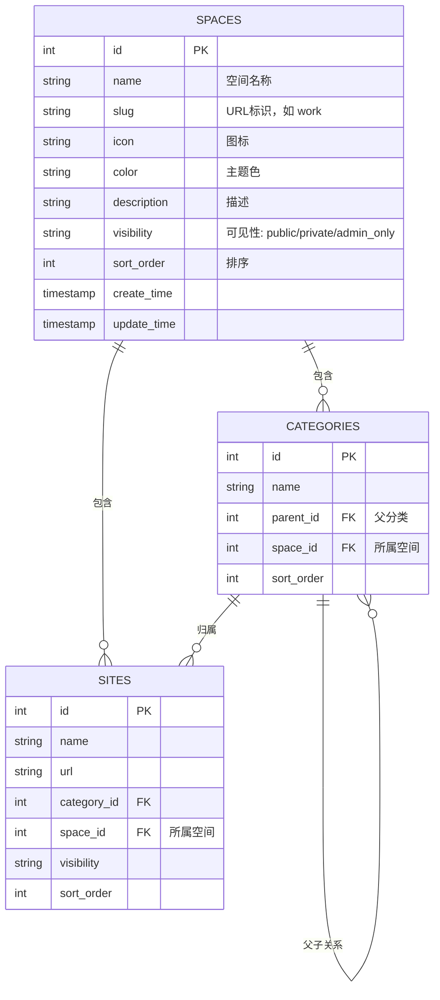

# StarNav 第三阶段开发规划：多空间 / 多导航页 (Multi-space)

> 阶段定位：在第二阶段“稳定性、可维护性、性能和体验打磨”圆满完成的基础上，第三阶段正式启动核心业务拓展，引入“多空间 / 多导航页”能力，支持用户将不同场景（如工作、生活、学习、设计）的书签和分类彻底隔离，实现 100% 完美向下兼容。

---

## 1. 架构设计方案

### 1.1 实体关系图 (ERD)

### 1.2 核心设计原则

1. **100% 完美向下兼容**：
   - 升级时，如果 `spaces` 表为空，系统会自动创建一个“默认空间”（`name: '默认空间', slug: 'default'`）。
   - 现有所有的分类（`categories`）和书签（`sites`）会自动关联到该默认空间。
   - 现有用户升级时数据零风险，体验完全无感。
2. **单窗口导航与状态恢复**：
   - 空间切换完全在当前窗口进行，支持通过 URL 参数 `/?space=slug` 访问。
   - 结合第二阶段实现的 PWA 状态恢复机制，切换空间或从外部返回时，能够完美恢复滚动位置和搜索词。
3. **安全与可见性隔离**：
   - 空间本身支持可见性设置（公开、私密、仅管理员）。
   - 访问私密空间需要验证空间密码（或复用系统私密密码，视具体设计而定）。
   - 空间删除时，级联删除该空间下的所有分类和书签，防止产生孤儿数据。

---

## 2. 详细任务执行计划

### 第一阶段：数据库与迁移服务 (D1 & Migration)

1. **修改 `schema.sql`**：
   - 新增 `spaces` 表。
   - 在 `categories` 表中新增 `space_id` 字段。
   - 在 `sites` 表中新增 `space_id` 字段。
2. **升级 `src/services/migrationService.js`**：
   - 自动创建 `spaces` 表。
   - 自动为 `categories` 和 `sites` 表新增 `space_id` 字段（使用 `ensureColumn`）。
   - **向下兼容迁移**：如果 `spaces` 表为空，自动插入一条默认空间数据（`name: '默认空间', slug: 'default'`），并将现有所有分类和书签的 `space_id` 设为该默认空间的 ID。

### 第二阶段：后端服务与 API 适配 (Services & APIs)

1. **新增 `src/services/spaceService.js`**：
   - 实现空间的 CRUD（创建、读取、更新、删除）。
   - 删除空间时，级联删除该空间下的所有分类和书签。
2. **新增空间管理 API**：
   - `GET /api/spaces`：获取空间列表（根据访客权限过滤，管理员可见全部）。
   - `POST /api/spaces`、`PUT /api/spaces/:id`、`DELETE /api/spaces/:id`（仅限管理员）。
3. **适配现有 API**：
   - `GET /api/sites`、`GET /api/categories`、`GET /api/search`：支持传入 `space` (slug) 参数，只返回该空间下的数据。如果不传，默认返回当前默认空间的数据。
   - `POST /api/config/submit`（前台提交）、`POST /api/sites`（后台新增）：支持指定 `space_id`。

### 第三阶段：前台页面与空间切换 (Frontend & PWA)

1. **侧边栏空间切换器**：
   - 在侧边栏顶部（网站名称下方）增加一个优雅的空间切换下拉菜单或滑动标签栏。
   - 支持通过 URL 参数 `/?space=slug` 访问指定空间。
2. **PWA 状态保存与恢复**：
   - 在 PWA 状态保存中，将当前选中的 `space` 也保存下来，确保返回时能回到正确的空间。

### 第四阶段：后台管理页面 (Admin Panel)

1. **新增“空间管理”页签**：
   - 管理员可以创建、修改、删除空间，调整空间顺序、图标、颜色和可见性。
2. **适配书签与分类管理**：
   - 在“书签列表”和“分类管理”中，增加空间筛选下拉框。
   - 支持在新增/编辑书签和分类时选择所属空间。
   - 批量操作：支持批量将选中的书签或分类移动到另一个空间。

---

## 3. 验收标准

- [ ] 数据库迁移成功，现有数据无缝归入“默认空间”。
- [ ] 后台能够成功创建、修改、删除空间。
- [ ] 前台能够通过侧边栏或 URL 参数完美切换空间。
- [ ] 空间可见性规则生效（私密空间/管理员空间在未授权时对访客不可见）。
- [ ] 单元测试覆盖空间 CRUD 与权限边界。
- [ ] `npm run quality` 稳定通过。